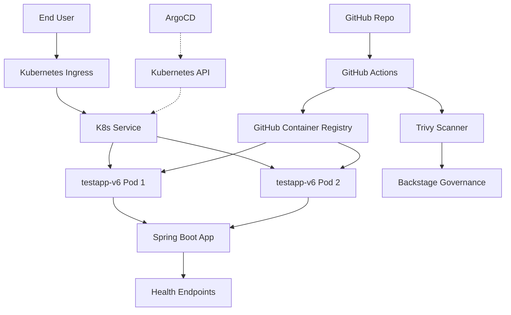
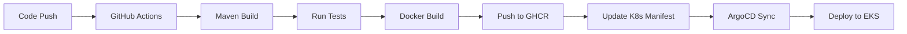
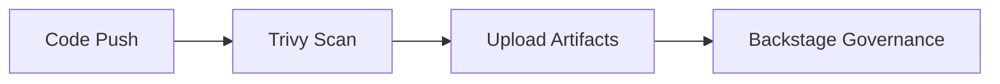
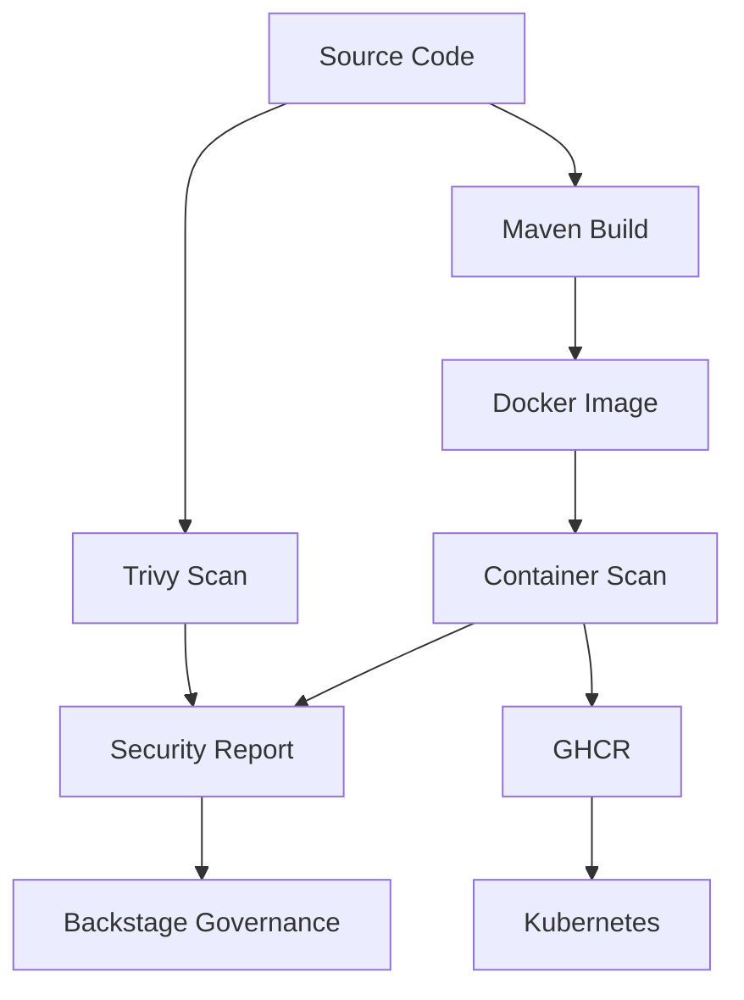

# Architecture Overview

High-level architecture and design decisions for testapp-v6.

## System Architecture



## Components

### Application Layer

**Spring Boot Application**
- Entry point: `Application.java`
- REST Controller with `/api/hello` endpoint
- Health endpoints via Spring Actuator
- Embedded Tomcat server

### Container Layer

**Docker Image**
- Base: `eclipse-temurin:17-jre-alpine`
- Multi-stage build for optimization
- Size: ~250MB
- Registry: GitHub Container Registry (GHCR)

### Kubernetes Layer

**Deployment**
- Replicas: 2 (for high availability)
- Resource limits: 512Mi-1Gi memory, 250m-500m CPU
- Liveness probe: `/actuator/health/liveness`
- Readiness probe: `/actuator/health/readiness`

**Service**
- Type: ClusterIP
- Port: 8080
- Selector: `app=testapp-v6`

**Ingress**
- Host: `testapp-v6.example.com`
- Path: `/`
- Annotations for SSL/TLS (when configured)

### CI/CD Pipeline



**Parallel Process:**


## Design Decisions

### Why Spring Boot 3.2?

✅ Latest LTS version  
✅ Native compilation support (GraalVM)  
✅ Improved observability  
✅ Better performance  

### Why GHCR over ECR?

✅ No AWS credentials needed  
✅ GitHub token authentication  
✅ Free for public/private repos  
✅ Integrated with GitHub Actions  

### Why ArgoCD?

✅ GitOps best practice  
✅ Declarative configuration  
✅ Self-healing deployments  
✅ Easy rollback via Git  

### Why Public Subnets?

✅ Simple networking  
✅ No NAT Gateway cost  
✅ Direct internet access  
✅ Easier debugging  

## Data Flow

### Request Flow

```
User Request
  ↓
Kubernetes Ingress
  ↓
Service (Load Balancer)
  ↓
Pod (Round-robin)
  ↓
Spring Boot Controller
  ↓
Business Logic
  ↓
Response
```

### Deployment Flow

```
Git Push (main branch)
  ↓
GitHub Actions Trigger
  ↓
Maven Build + Test
  ↓
Docker Image Build
  ↓
Push to GHCR
  ↓
Update k8s/deployment.yaml
  ↓
ArgoCD Detects Change
  ↓
ArgoCD Applies to EKS
  ↓
Rolling Update (Zero Downtime)
```

## Security Architecture



**Security Layers:**
1. **Code Scanning**: Trivy checks dependencies
2. **Container Scanning**: Image vulnerability scan
3. **Runtime**: Kubernetes security contexts
4. **Network**: Service mesh (future)

## Scalability

### Current Capacity

- **Replicas**: 2
- **Max Concurrent Requests**: ~200 per pod
- **Total Capacity**: ~400 requests/second

### Scaling Strategy

**Horizontal Pod Autoscaler (HPA):**

```yaml
# Future implementation
apiVersion: autoscaling/v2
kind: HorizontalPodAutoscaler
metadata:
  name: testapp-v6-hpa
spec:
  scaleTargetRef:
    apiVersion: apps/v1
    kind: Deployment
    name: testapp-v6
  minReplicas: 2
  maxReplicas: 10
  metrics:
  - type: Resource
    resource:
      name: cpu
      target:
        type: Utilization
        averageUtilization: 70
```

## High Availability

### Current Setup

- ✅ Multiple replicas (2)
- ✅ Rolling update strategy
- ✅ Health probes (liveness + readiness)
- ✅ Pod anti-affinity (planned)

### Disaster Recovery

- **RTO** (Recovery Time Objective): < 5 minutes
- **RPO** (Recovery Point Objective): Real-time (stateless)

Rollback:
```bash
# Via ArgoCD
argocd app rollback testapp-v6

# Via kubectl
kubectl rollout undo deployment/testapp-v6 -n default
```

## Dependencies

### Runtime Dependencies

- Java 17 JRE
- Spring Boot 3.2.0
- Embedded Tomcat

### Build Dependencies

- Maven 3.8+
- Docker BuildKit

### Infrastructure Dependencies

- Kubernetes 1.32+
- ArgoCD (for GitOps)
- GHCR (for images)

## Monitoring Points

| Metric | Endpoint | Purpose |
|--------|----------|---------|
| Health | `/actuator/health` | Overall status |
| Metrics | `/actuator/metrics` | JVM metrics |
| Info | `/actuator/info` | Build info |
| Prometheus | `/actuator/prometheus` | Metrics export |

## Future Enhancements

- [ ] Database integration (PostgreSQL)
- [ ] Redis cache layer
- [ ] Message queue (Kafka)
- [ ] Service mesh (Istio)
- [ ] Distributed tracing (Jaeger)
- [ ] API Gateway integration

---

**Next**: Learn about [Deployment](deployment.md)
