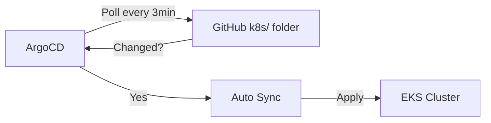

# ArgoCD GitOps

Learn how testapp-v6 uses ArgoCD for continuous deployment.

## What is ArgoCD?

ArgoCD is a declarative, GitOps continuous delivery tool for Kubernetes.

**Key Principles:**
- 📖 Git as the single source of truth
- 🔄 Automated sync from Git to cluster
- 🔍 Visual representation of application state
- 🎯 Rollback = Git revert

## ArgoCD Application Configuration

testapp-v6's ArgoCD configuration:

```yaml
# argocd/application.yaml
apiVersion: argoproj.io/v1alpha1
kind: Application
metadata:
  name: testapp-v6
  namespace: argocd
spec:
  project: default
  source:
    repoURL: https://github.com/kisung-backstage-demo-org/testapp-v6.git
    targetRevision: main
    path: k8s/              # 📂 Monitors this folder!
  destination:
    server: https://kubernetes.default.svc
    namespace: default
  syncPolicy:
    automated:
      prune: true           # Delete removed resources
      selfHeal: true        # Auto-fix drift
      allowEmpty: false
```

## How It Works

### 1. Initial Setup

```bash
# ArgoCD Application is registered automatically by GitHub Actions
# Or manually:
kubectl apply -f argocd/application.yaml
```

### 2. Continuous Monitoring

ArgoCD checks the `k8s/` folder every **3 minutes**:



### 3. Deployment Flow

```
Code Change
  ↓
GitHub Actions
  ├─ Build Docker image
  ├─ Push to GHCR
  └─ Update k8s/deployment.yaml (new image tag)
  ↓
Git Commit (by bot)
  ↓
ArgoCD Detects Change
  ↓
ArgoCD Syncs (auto)
  ↓
Rolling Update in EKS
```

## ArgoCD UI Access

### Port Forward

```bash
kubectl port-forward svc/argocd-server -n argocd 8080:443
```

Access at: `https://localhost:`

### Login Credentials

```bash
# Username
echo "admin"

# Password
kubectl -n argocd get secret argocd-initial-admin-secret \
  -o jsonpath='{.data.password}' | base64 -d && echo
```

## Application Operations

### View Application Status

```bash
# List applications
kubectl get application -n argocd

# Detailed status
kubectl describe application testapp-v6 -n argocd

# ArgoCD CLI
argocd app get testapp-v6
```

### Manual Sync

```bash
# Trigger sync manually
argocd app sync testapp-v6

# Sync and wait
argocd app sync testapp-v6 --wait

# Via kubectl
kubectl patch application testapp-v6 -n argocd \
  --type merge \
  -p '{"operation":{"initiatedBy":{"username":"admin"},"sync":{}}}'
```

### Rollback

```bash
# Via ArgoCD CLI
argocd app rollback testapp-v6

# Via Git revert
git revert <commit-hash>
git push
# ArgoCD will auto-sync to previous state
```

### Diff

```bash
# Show difference between Git and cluster
argocd app diff testapp-v6
```

## Sync Policies

### Automated Sync (Current)

```yaml
syncPolicy:
  automated:
    prune: true      # Delete resources not in Git
    selfHeal: true   # Fix manual changes
```

**Behavior:**
- ✅ Auto-sync on Git changes
- ✅ Auto-delete removed resources
- ✅ Auto-fix manual kubectl changes
- ✅ No manual approval needed

### Manual Sync (Alternative)

```yaml
syncPolicy:
  automated: null  # Disable auto-sync
```

**Behavior:**
- ⏸️ Wait for manual sync trigger
- ✅ Review changes before apply
- ✅ Controlled deployment timing

## ArgoCD Health Status

### Application Health

| Status | Meaning |
|--------|---------|
| **Healthy** | All resources running correctly |
| **Progressing** | Deployment in progress |
| **Degraded** | Some resources unhealthy |
| **Suspended** | Application paused |
| **Missing** | Expected resources not found |

### Sync Status

| Status | Meaning |
|--------|---------|
| **Synced** | Git matches cluster |
| **OutOfSync** | Git differs from cluster |
| **Unknown** | Unable to determine |

## Monitoring ArgoCD

### View Logs

```bash
# ArgoCD application controller logs
kubectl logs -n argocd -l app.kubernetes.io/name=argocd-application-controller

# ArgoCD server logs
kubectl logs -n argocd -l app.kubernetes.io/name=argocd-server
```

### Metrics

```bash
# ArgoCD metrics endpoint
kubectl port-forward -n argocd svc/argocd-metrics 8082:8082

# Access metrics
curl http://localhost:8082/metrics
```

## Advanced Features

### Resource Hooks

Pre-sync and post-sync hooks:

```yaml
# Example: Database migration hook
apiVersion: batch/v1
kind: Job
metadata:
  name: db-migration
  annotations:
    argocd.argoproj.io/hook: PreSync
    argocd.argoproj.io/hook-delete-policy: BeforeHookCreation
spec:
  template:
    spec:
      containers:
      - name: migrate
        image: flyway/flyway
        command: ["flyway", "migrate"]
```

### Sync Waves

Control deployment order:

```yaml
metadata:
  annotations:
    argocd.argoproj.io/sync-wave: "1"  # Deploy first
```

Lower numbers deploy first.

### App of Apps Pattern

Manage multiple apps with one parent app (future feature).

## Integration with Backstage

### View in Backstage

```
Backstage Catalog → testapp-v6 → Overview
```

**Annotations:**
```yaml
annotations:
  argocd/app-name: "testapp-v6"
```

### Backstage Links

- ArgoCD UI link
- Sync status badge
- Deployment history

## Best Practices

✅ **Always use Git** - Never kubectl apply manually  
✅ **Use ArgoCD UI** - Visualize sync status  
✅ **Enable selfHeal** - Prevent configuration drift  
✅ **Tag images with SHA** - Reproducible builds  
✅ **Use sync waves** - Control deployment order  
✅ **Monitor sync status** - Detect issues early  

## Troubleshooting

### Application OutOfSync

```bash
# View differences
argocd app diff testapp-v6

# Force sync
argocd app sync testapp-v6 --force
```

### Sync Failed

```bash
# View sync errors
kubectl describe application testapp-v6 -n argocd

# Check application logs
kubectl logs -l app=testapp-v6 -n default --tail=100
```

### Resource Not Updating

```bash
# Delete and recreate (ArgoCD will recreate)
kubectl delete pod <pod-name> -n default

# Or force sync
argocd app sync testapp-v6 --replace
```

---

**Next**: Review [Security Overview](security.md)
