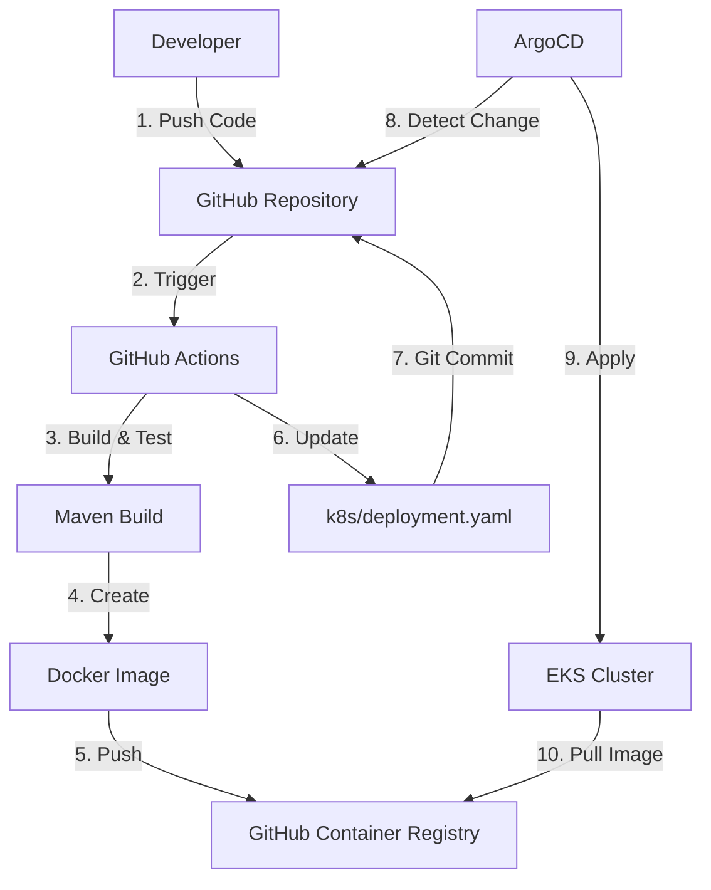

# Kubernetes Deployment

Complete guide for deploying testapp-v6 to Kubernetes clusters.

## Deployment Overview

testapp-v6 uses **GitOps** methodology via ArgoCD for automated, declarative deployments.

## Deployment Architecture



## Prerequisites

### 1. EKS Cluster Access

```bash
# Configure kubectl
aws eks update-kubeconfig \
  --name demo \
  --region ap-northeast-2

# Verify access
kubectl get nodes
```

### 2. ArgoCD Installation

If ArgoCD is not installed:

```bash
kubectl create namespace argocd
kubectl apply -n argocd -f \
  https://raw.githubusercontent.com/argoproj/argo-cd/stable/manifests/install.yaml

# Wait for ready
kubectl wait --for=condition=ready pod \
  -l app.kubernetes.io/name=argocd-server \
  -n argocd --timeout=300s
```

## Deployment Methods

### Method 1: GitOps (Recommended)

**Fully automated via ArgoCD**

1. Push code to `main` branch
2. GitHub Actions builds and updates manifest
3. ArgoCD automatically syncs
4. Zero manual intervention!

```bash
# Check ArgoCD Application status
kubectl get application testapp-v6 -n argocd

# View sync status
kubectl describe application testapp-v6 -n argocd
```

### Method 2: Manual kubectl

```bash
# Clone repository
git clone https://github.com/kisung-backstage-demo-org/testapp-v6.git
cd testapp-v6

# Apply Kubernetes manifests
kubectl apply -f k8s/deployment.yaml
kubectl apply -f k8s/service.yaml
kubectl apply -f k8s/ingress.yaml

# Verify deployment
kubectl get deployment testapp-v6 -n default
kubectl get pods -l app=testapp-v6 -n default
```

### Method 3: Helm (Future)

```bash
# Install
helm install testapp-v6 ./helm-chart

# Upgrade
helm upgrade testapp-v6 ./helm-chart

# Rollback
helm rollback testapp-v6
```

## Kubernetes Manifests

### Deployment Configuration

```yaml
# k8s/deployment.yaml
apiVersion: apps/v1
kind: Deployment
metadata:
  name: testapp-v6
  namespace: default
spec:
  replicas: 2
  strategy:
    type: RollingUpdate
    rollingUpdate:
      maxSurge: 1
      maxUnavailable: 0
  template:
    spec:
      containers:
      - name: testapp-v6
        image: ghcr.io/kisung-backstage-demo-org/testapp-v6:latest
        resources:
          requests:
            memory: "512Mi"
            cpu: "250m"
          limits:
            memory: "1Gi"
            cpu: "500m"
        livenessProbe:
          httpGet:
            path: /actuator/health/liveness
            port: 8080
          initialDelaySeconds: 30
          periodSeconds: 10
        readinessProbe:
          httpGet:
            path: /actuator/health/readiness
            port: 8080
          initialDelaySeconds: 20
          periodSeconds: 5
```

## Rolling Updates

### Zero-Downtime Deployment

```bash
# Update image
kubectl set image deployment/testapp-v6 \
  testapp-v6=ghcr.io/kisung-backstage-demo-org/testapp-v6:v1.1.0 \
  -n default

# Watch rollout
kubectl rollout status deployment/testapp-v6 -n default

# View rollout history
kubectl rollout history deployment/testapp-v6 -n default
```

### Rollback

```bash
# Rollback to previous version
kubectl rollout undo deployment/testapp-v6 -n default

# Rollback to specific revision
kubectl rollout undo deployment/testapp-v6 -n default --to-revision=2
```

## Scaling

### Manual Scaling

```bash
# Scale up
kubectl scale deployment testapp-v6 --replicas=5 -n default

# Scale down
kubectl scale deployment testapp-v6 --replicas=2 -n default
```

### Horizontal Pod Autoscaler (Future)

```yaml
apiVersion: autoscaling/v2
kind: HorizontalPodAutoscaler
metadata:
  name: testapp-v6-hpa
spec:
  scaleTargetRef:
    apiVersion: apps/v1
    kind: Deployment
    name: testapp-v6
  minReplicas: 2
  maxReplicas: 10
  metrics:
  - type: Resource
    resource:
      name: cpu
      target:
        type: Utilization
        averageUtilization: 70
```

## Health Checks

### Liveness Probe

Kubernetes kills and restarts the pod if liveness fails.

```yaml
livenessProbe:
  httpGet:
    path: /actuator/health/liveness
    port: 8080
  initialDelaySeconds: 30  # Wait 30s after start
  periodSeconds: 10        # Check every 10s
  failureThreshold: 3      # Restart after 3 failures
```

### Readiness Probe

Kubernetes removes pod from service if readiness fails.

```yaml
readinessProbe:
  httpGet:
    path: /actuator/health/readiness
    port: 8080
  initialDelaySeconds: 20  # Wait 20s after start
  periodSeconds: 5         # Check every 5s
  failureThreshold: 3      # Remove after 3 failures
```

## Networking

### Service

```yaml
apiVersion: v1
kind: Service
metadata:
  name: testapp-v6
spec:
  type: ClusterIP
  ports:
  - port: 8080
    targetPort: 8080
    protocol: TCP
  selector:
    app: testapp-v6
```

**Access:**
```bash
# From within cluster
curl http://testapp-v6.default.svc.cluster.local:/api/hello

# Via port-forward
kubectl port-forward svc/testapp-v6 8080: -n default
curl http://localhost:/api/hello
```

### Ingress

```yaml
apiVersion: networking.k8s.io/v1
kind: Ingress
metadata:
  name: testapp-v6
spec:
  rules:
  - host: testapp-v6.example.com
    http:
      paths:
      - path: /
        pathType: Prefix
        backend:
          service:
            name: testapp-v6
            port:
              number: 8080
```

## Resource Management

### Current Allocation

Per Pod:
- **CPU Request**: 250m (0.25 cores)
- **CPU Limit**: 500m (0.5 cores)
- **Memory Request**: 512Mi
- **Memory Limit**: 1Gi

Total (2 replicas):
- **CPU**: 0.5 cores request, 1 core limit
- **Memory**: 1Gi request, 2Gi limit

### Tuning Guidelines

**Low Traffic:**
```yaml
resources:
  requests:
    memory: "256Mi"
    cpu: "100m"
  limits:
    memory: "512Mi"
    cpu: "250m"
```

**High Traffic:**
```yaml
resources:
  requests:
    memory: "1Gi"
    cpu: "500m"
  limits:
    memory: "2Gi"
    cpu: "1000m"
```

## Deployment Verification

### Step-by-Step Verification

```bash
# 1. Check deployment status
kubectl get deployment testapp-v6 -n default

# 2. Check pod status
kubectl get pods -l app=testapp-v6 -n default

# 3. Check pod logs
kubectl logs -l app=testapp-v6 -n default --tail=50

# 4. Check service endpoints
kubectl get endpoints testapp-v6 -n default

# 5. Test API
kubectl run curl-test --image=curlimages/curl -i --rm --restart=Never -- \
  curl http://testapp-v6.default.svc.cluster.local:/api/hello
```

### Health Checks

```bash
# Via port-forward
kubectl port-forward svc/testapp-v6 8080: -n default

# In another terminal
curl http://localhost:/actuator/health
curl http://localhost:/actuator/health/liveness
curl http://localhost:/actuator/health/readiness
```

## Troubleshooting Deployments

### Pod Not Starting

```bash
# Check pod events
kubectl describe pod <pod-name> -n default

# Check logs
kubectl logs <pod-name> -n default

# Check previous logs (if crashed)
kubectl logs <pod-name> -n default --previous
```

### Image Pull Errors

```bash
# Check image exists in GHCR
docker pull ghcr.io/kisung-backstage-demo-org/testapp-v6:latest

# Check imagePullSecrets (if needed)
kubectl get secrets -n default
```

### Service Not Reachable

```bash
# Check service endpoints
kubectl get endpoints testapp-v6 -n default

# Check service
kubectl describe service testapp-v6 -n default

# Test from debug pod
kubectl run debug --image=busybox -i --rm --restart=Never -- \
  wget -O- http://testapp-v6.default.svc.cluster.local:/actuator/health
```

## Best Practices

✅ Always use health probes  
✅ Set resource requests and limits  
✅ Use rolling updates  
✅ Tag images with commit SHA (not just :latest)  
✅ Enable ArgoCD auto-sync  
✅ Monitor deployment metrics  

---

**Next**: Learn about [ArgoCD GitOps](argocd.md)
