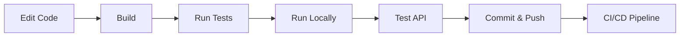

# Local Development

Complete guide for developing testapp-v6 on your local machine.

## Development Workflow



## Project Structure

```
testapp-v6/
├── src/
│   ├── main/
│   │   ├── java/com/example/service/
│   │   │   └── Application.java        # Main application
│   │   └── resources/
│   │       └── application.yml         # Configuration
│   └── test/                            # Unit tests
├── k8s/                                 # Kubernetes manifests
├── argocd/                              # ArgoCD configuration
├── docs/                                # This documentation
├── pom.xml                              # Maven configuration
├── Dockerfile                           # Container build
└── README.md
```

## Running the Application

### Method 1: Maven Spring Boot Plugin

```bash
# Development mode with hot reload
mvn spring-boot:run

# With specific profile
mvn spring-boot:run -Dspring-boot.run.profiles=dev

# With debug port
mvn spring-boot:run -Dspring-boot.run.jvmArguments="-Xdebug -Xrunjdwp:transport=dt_socket,server=y,suspend=n,address=5005"
```

### Method 2: JAR File

```bash
# Build
mvn clean package

# Run
java -jar target/testapp-v6-1.0.0.jar

# With profile
java -jar target/testapp-v6-1.0.0.jar --spring.profiles.active=dev
```

### Method 3: IDE

**IntelliJ IDEA:**
1. Right-click `Application.java`
2. Select "Run 'Application.main()'"
3. Debug mode: Select "Debug 'Application.main()'"

**VS Code:**
1. Open Run and Debug (Ctrl+Shift+D)
2. Select "Spring Boot Application"
3. Press F5 to start

## Development Features

### Hot Reload (Spring DevTools)

Add to `pom.xml`:

```xml
<dependency>
    <groupId>org.springframework.boot</groupId>
    <artifactId>spring-boot-devtools</artifactId>
    <optional>true</optional>
</dependency>
```

Changes will auto-reload without restart!

### Live Testing

```bash
# Terminal 1: Run application
mvn spring-boot:run

# Terminal 2: Test endpoints
watch -n 1 curl http://localhost:/api/hello
```

## Database (Future)

Currently no database is configured. When needed:

```yaml
# application-dev.yml
spring:
  datasource:
    url: jdbc:postgresql://localhost:5432/testapp-v6
    username: dev
    password: dev
  jpa:
    hibernate:
      ddl-auto: update
    show-sql: true
```

## Environment Profiles

### Development Profile

```yaml
# application-dev.yml
server:
  port: 8080
logging:
  level:
    com.example.service: DEBUG
```

### Test Profile

```yaml
# application-test.yml
spring:
  datasource:
    url: jdbc:h2:mem:testdb
```

## Code Style

### Formatting

```bash
# Format code (if using Spotless)
mvn spotless:apply

# Check formatting
mvn spotless:check
```

### Linting

```bash
# Run checkstyle
mvn checkstyle:check

# Generate report
mvn checkstyle:checkstyle
```

## Testing

### Unit Tests

```bash
# Run all tests
mvn test

# Run specific test class
mvn test -Dtest=ApplicationTest

# Run with coverage
mvn test jacoco:report
```

### Integration Tests

```bash
# Run integration tests
mvn verify

# Skip unit tests, run only integration tests
mvn verify -DskipUnitTests
```

### Test Coverage

```bash
mvn clean test jacoco:report

# View report
open target/site/jacoco/index.html
```

## Debugging

### Remote Debugging

```bash
# Start with debug port
java -agentlib:jdwp=transport=dt_socket,server=y,suspend=n,address=*:5005 \
     -jar target/testapp-v6-1.0.0.jar
```

Connect your IDE debugger to `localhost:5005`.

### Logging

```bash
# Increase logging level
export LOGGING_LEVEL_ROOT=DEBUG
mvn spring-boot:run

# Log to file
java -jar target/testapp-v6-1.0.0.jar --logging.file.name=app.log
```

## Performance Profiling

### JVM Metrics

Access at: `http://localhost:/actuator/metrics`

```bash
# Memory usage
curl http://localhost:/actuator/metrics/jvm.memory.used

# HTTP requests
curl http://localhost:/actuator/metrics/http.server.requests
```

### Heap Dump

```bash
# Generate heap dump
jmap -dump:live,format=b,file=heap.bin <PID>

# Analyze with VisualVM or Eclipse MAT
```

## Tips & Tricks

### Fast Rebuild

```bash
# Skip tests for quick builds
mvn clean package -DskipTests
```

### Docker Build Speed

```bash
# Use BuildKit for faster builds
DOCKER_BUILDKIT=1 docker build -t testapp-v6:local .
```

### Dependency Updates

```bash
# Check for updates
mvn versions:display-dependency-updates

# Update versions
mvn versions:use-latest-releases
```

## Common Issues

### Port Already in Use

```bash
# Find process using port 8080
lsof -i :

# Kill process
kill -9 <PID>
```

### Maven Dependencies Not Resolving

```bash
# Clear local repository cache
rm -rf ~/.m2/repository/com/example

# Force update
mvn clean install -U
```

### Docker Build Fails

```bash
# Clean Docker cache
docker system prune -a

# Rebuild without cache
docker build --no-cache -t testapp-v6:local .
```

---

**Ready to deploy?** Check out the [Deployment Guide](deployment.md)!
