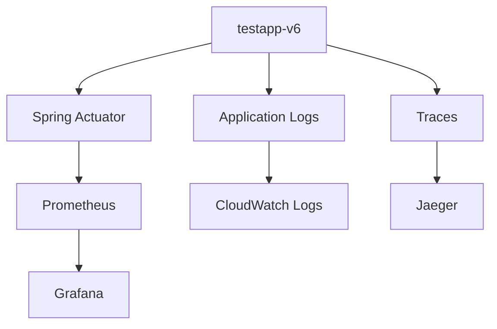

# Monitoring & Observability

Monitor testapp-v6 health, performance, and availability.

## Monitoring Stack



## Current Monitoring

### Spring Boot Actuator

**Endpoints:**
- `/actuator/health` - Health status
- `/actuator/metrics` - Application metrics
- `/actuator/info` - Build information

```bash
# Health check
curl http://localhost:/actuator/health

# All metrics
curl http://localhost:/actuator/metrics

# Specific metric
curl http://localhost:/actuator/metrics/jvm.memory.used
```

### Kubernetes Health Checks

**Liveness Probe:**
```yaml
livenessProbe:
  httpGet:
    path: /actuator/health/liveness
    port: 8080
  initialDelaySeconds: 30
  periodSeconds: 10
```

**Readiness Probe:**
```yaml
readinessProbe:
  httpGet:
    path: /actuator/health/readiness
    port: 8080
  initialDelaySeconds: 20
  periodSeconds: 5
```

## Key Metrics

### Application Metrics

| Metric | Description | Endpoint |
|--------|-------------|----------|
| **JVM Memory** | Heap usage | `/actuator/metrics/jvm.memory.used` |
| **HTTP Requests** | Request count | `/actuator/metrics/http.server.requests` |
| **CPU Usage** | Process CPU | `/actuator/metrics/process.cpu.usage` |
| **Threads** | Active threads | `/actuator/metrics/jvm.threads.live` |

### Infrastructure Metrics

```bash
# Pod CPU/Memory
kubectl top pod -l app=testapp-v6 -n default

# Node resource usage
kubectl top nodes

# Deployment status
kubectl get deployment testapp-v6 -n default -o wide
```

## Dashboards

### Kubernetes Dashboard (Planned)

Access at: `http://localhost:8001/api/v1/namespaces/kubernetes-dashboard/services/https:kubernetes-dashboard:/proxy/`

**Metrics:**
- Pod count and status
- Resource utilization
- Network traffic
- Event logs

### Backstage Integration

**Available in Backstage:**
- Kubernetes plugin tab
- Real-time pod status
- Deployment history
- Resource utilization

**Access:**
```
http://localhost:7007/catalog/default/component/testapp-v6/kubernetes
```

## Logging

### Application Logs

```bash
# View logs
kubectl logs -l app=testapp-v6 -n default

# Follow logs
kubectl logs -l app=testapp-v6 -n default -f

# Last 100 lines
kubectl logs -l app=testapp-v6 -n default --tail=100

# Specific container
kubectl logs <pod-name> -c testapp-v6 -n default
```

### Log Levels

```yaml
# application.yml
logging:
  level:
    root: INFO
    com.example.service: DEBUG
```

### Structured Logging (Planned)

```json
{
  "timestamp": "2025-11-27T12:00:00.000Z",
  "level": "INFO",
  "service": "testapp-v6",
  "message": "Request processed",
  "duration_ms": 45,
  "http_method": "GET",
  "http_path": "/api/hello"
}
```

## Alerting (Planned)

### Alert Rules

**Critical Alerts:**
- Pod crash loop
- High error rate (> 5%)
- Memory usage > 90%
- All pods down

**Warning Alerts:**
- High response time (> 1s)
- CPU usage > 80%
- Deployment rollout failure

### Alert Channels

- Slack: #alerts-production
- PagerDuty: On-call team
- Email: team@example.com

## Performance Monitoring

### Response Time

```bash
# Average response time
kubectl exec -it <pod-name> -n default -- \
  curl -w "@curl-format.txt" -o /dev/null -s \
  http://localhost:/api/hello
```

### Throughput

```bash
# Request count from metrics
curl http://localhost:/actuator/metrics/http.server.requests
```

## Health Status

### Status Indicators

| Status | Meaning | Action |
|--------|---------|--------|
| ✅ **UP** | All systems operational | None |
| ⚠️ **DEGRADED** | Some issues detected | Investigate |
| 🔴 **DOWN** | Service unavailable | Immediate action |

### Health Check Response

```json
{
  "status": "UP",
  "components": {
    "diskSpace": { "status": "UP" },
    "ping": { "status": "UP" }
  }
}
```

## Distributed Tracing (Planned)

### OpenTelemetry Integration

```xml
<dependency>
    <groupId>io.opentelemetry</groupId>
    <artifactId>opentelemetry-api</artifactId>
</dependency>
```

**Features:**
- Request tracing across services
- Latency analysis
- Error tracking
- Dependency mapping

## Monitoring Checklist

### Daily

- [ ] Check pod status
- [ ] Review error logs
- [ ] Verify health endpoints

### Weekly

- [ ] Review Trivy scan results
- [ ] Check resource utilization
- [ ] Review performance trends

### Monthly

- [ ] Capacity planning review
- [ ] Update monitoring dashboards
- [ ] Security audit

## Troubleshooting Monitoring

### Metrics Not Available

```bash
# Check actuator endpoints
curl http://localhost:/actuator

# Verify Spring Boot Actuator dependency
mvn dependency:tree | grep actuator
```

### Health Check Failing

```bash
# Check pod logs
kubectl logs -l app=testapp-v6 -n default --tail=50

# Describe pod
kubectl describe pod <pod-name> -n default

# Check events
kubectl get events -n default --sort-by='.lastTimestamp'
```

---

**Related**: [Troubleshooting Guide](troubleshooting.md)
