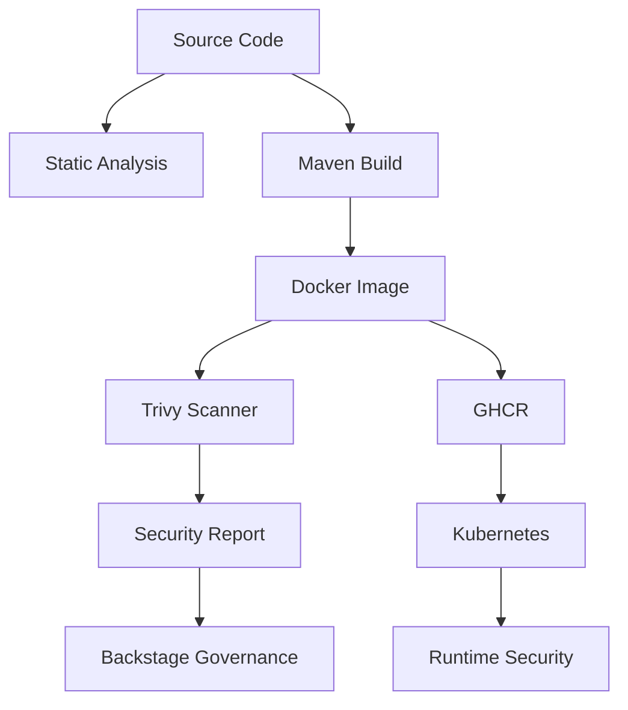
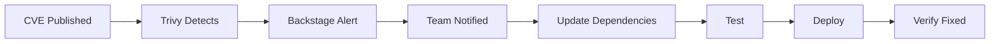

# Security Overview

Comprehensive security practices and governance for testapp-v6.

## Security Architecture



## Security Layers

### 1. Code Level Security

**Dependency Scanning**
- ✅ Trivy scans all Maven dependencies
- ✅ Weekly automated scans
- ✅ Alerts on Critical/High vulnerabilities

**Static Analysis**
- Checkstyle rules
- SpotBugs (planned)
- SonarQube (planned)

### 2. Container Security

**Image Scanning**
- Trivy vulnerability scanner
- Base image: `eclipse-temurin:17-jre-alpine` (minimal attack surface)
- Multi-stage build (excludes build tools from runtime)

**Best Practices:**
- ✅ Minimal base image
- ✅ Non-root user
- ✅ Read-only filesystem (planned)
- ✅ Security scanning in CI/CD

### 3. Kubernetes Security

**Pod Security**
```yaml
securityContext:
  runAsNonRoot: true
  runAsUser: 1000
  fsGroup: 1000
  capabilities:
    drop:
      - ALL
  readOnlyRootFilesystem: true  # Planned
```

**Network Policies** (Planned)
```yaml
apiVersion: networking.k8s.io/v1
kind: NetworkPolicy
metadata:
  name: testapp-v6-netpol
spec:
  podSelector:
    matchLabels:
      app: testapp-v6
  policyTypes:
  - Ingress
  - Egress
  ingress:
  - from:
    - namespaceSelector: {}
    ports:
    - protocol: TCP
      port: 8080
```

### 4. Runtime Security

**Security Scanning**
- Container image scanning via Trivy
- Vulnerability database auto-update
- Compliance scoring in Backstage

**Secrets Management**
- Kubernetes Secrets
- External Secrets Operator (planned)
- AWS Secrets Manager integration (planned)

## Vulnerability Management

### Severity Levels

| Severity | Response Time | Action |
|----------|--------------|--------|
| **Critical** | < 24 hours | Immediate patch + deploy |
| **High** | < 7 days | Scheduled patch |
| **Medium** | < 30 days | Include in next sprint |
| **Low** | Next major release | Track in backlog |

### Compliance Scoring

View real-time security score in [Backstage Governance](http://localhost:7007/catalog/default/component/testapp-v6/governance).

**Score Calculation:**
```
Base Score: 100
- Critical: -30 points each
- High: -15 points each
- Medium: -5 points each
- Low: -1 point each
Minimum: 0
```

## Trivy Scanning

### Automated Scans

**Triggers:**
- Every push to `main` branch
- Every pull request
- Weekly schedule (Sunday 00:00 UTC)

**Workflow:**
```yaml
# .github/workflows/trivy-scan.yml
- Builds Docker image
- Runs Trivy vulnerability scan
- Uploads JSON report as artifact
- Displayed in Backstage Governance tab
```

### Manual Scan

```bash
# Local Trivy scan
docker build -t testapp-v6:scan .
trivy image testapp-v6:scan

# Scan with JSON output
trivy image -f json -o report.json testapp-v6:scan
```

## Security Checklist

### Development

- [ ] No hardcoded secrets
- [ ] Input validation on all endpoints
- [ ] Proper error handling (no stack traces to users)
- [ ] Dependency versions pinned in `pom.xml`
- [ ] Security headers configured

### Pre-Deployment

- [ ] Trivy scan passed
- [ ] No Critical vulnerabilities
- [ ] < 5 High vulnerabilities
- [ ] Dependencies up-to-date
- [ ] Image tagged with commit SHA

### Production

- [ ] HTTPS/TLS enabled
- [ ] Authentication enabled
- [ ] Authorization rules configured
- [ ] Rate limiting enabled
- [ ] WAF configured (if applicable)

## Compliance & Standards

### Industry Standards

- ✅ OWASP Top 10 awareness
- ✅ CIS Benchmarks (Docker)
- ✅ NIST Cybersecurity Framework (planned)

### Internal Policies

- ✅ No secrets in code
- ✅ Minimal privileges
- ✅ Encrypted data at rest
- ✅ Regular security updates

## Security Contacts

### Report a Vulnerability

**DO NOT** create public GitHub issues for security vulnerabilities.

**Instead:**
1. Email: security@example.com
2. Slack: #security-team
3. PagerDuty: Security on-call

### Security Team

- **Platform Team**: Infrastructure security
- **AppSec Team**: Application security
- **InfoSec Team**: Policy and compliance

## Security Updates

### Patching Process



### Emergency Patch

For Critical vulnerabilities:

```bash
# 1. Update dependency in pom.xml
vim pom.xml

# 2. Test locally
mvn clean test

# 3. Push to main
git commit -am "Security patch: CVE-XXXX-YYYY"
git push

# 4. CI/CD auto-deploys
# 5. Verify in Backstage Governance tab
```

## Security Monitoring

### Real-Time Monitoring

- **Backstage Governance Tab**: Security score and CVEs
- **GitHub Security**: Dependabot alerts
- **ArgoCD**: Deployment security events

### Audit Logs

```bash
# Kubernetes audit logs
kubectl logs -n kube-system -l component=kube-apiserver

# ArgoCD audit
kubectl logs -n argocd -l app.kubernetes.io/name=argocd-server
```

## Data Protection

### Data at Rest

- ✅ EBS volumes encrypted
- ✅ Secrets encrypted in etcd
- ✅ No persistent data storage currently

### Data in Transit

- ✅ TLS for external traffic (via Ingress)
- ✅ Service-to-service: Planned (Service Mesh)
- ✅ GitHub token encryption

## Incident Response

### Security Incident Playbook

1. **Detect**: Trivy scan, Backstage alert
2. **Assess**: Review CVE details, impact analysis
3. **Contain**: Rollback if actively exploited
4. **Remediate**: Patch and deploy
5. **Review**: Post-mortem, update processes

### Emergency Contacts

- **Security Team**: security-oncall@example.com
- **Platform Team**: platform-team@example.com
- **Backstage Support**: Slack #backstage-help

---

**For detailed vulnerability info**: Check [Trivy Scanning](trivy-scan.md)
