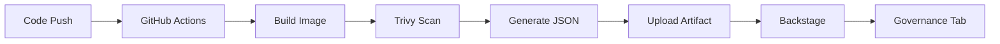
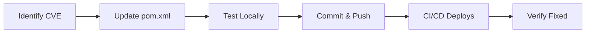

# Trivy Vulnerability Scanning

Automated security scanning with Trivy for testapp-v6.

## What is Trivy?

Trivy is a comprehensive security scanner that finds:

- 🐛 Vulnerabilities in dependencies
- 📦 Issues in container images
- ⚙️ Misconfigurations in IaC
- 🔒 Secrets in code (planned)

**Official**: [aquasecurity/trivy](https://github.com/aquasecurity/trivy)

## Scan Workflow

### Automated Scanning

```yaml
# .github/workflows/trivy-scan.yml
name: Security Scan (Trivy)

on:
  push:
    branches: [ main ]      # Every commit
  pull_request:             # Every PR
  schedule:
    - cron: '0 0 * * 0'     # Weekly (Sunday 00:00)
```

### Scan Process



## Scan Reports

### Viewing Results

**In GitHub:**
```
https://github.com/kisung-backstage-demo-org/testapp-v6/actions/workflows/trivy-scan.yml
→ Latest run → Artifacts → trivy-report
```

**In Backstage:**
```
http://localhost:7007/catalog/default/component/testapp-v6/governance
```

### Report Format

```json
{
  "Results": [
    {
      "Target": "testapp-v6:scan",
      "Vulnerabilities": [
        {
          "VulnerabilityID": "CVE-2024-1234",
          "PkgName": "spring-core",
          "InstalledVersion": "5.3.20",
          "FixedVersion": "5.3.25",
          "Severity": "CRITICAL",
          "Title": "Remote Code Execution",
          "Description": "..."
        }
      ]
    }
  ]
}
```

## Scan Types

### 1. Vulnerability Scan

Scans Docker image for known vulnerabilities (CVEs).

```bash
trivy image \
  --format json \
  --output trivy-report.json \
  --vuln-type os,library \
  --severity CRITICAL,HIGH,MEDIUM,LOW \
  testapp-v6:latest
```

**Checks:**
- OS packages (Alpine APK)
- Java libraries (Maven dependencies)
- Known CVE database

### 2. Config Scan

Scans configuration files for misconfigurations.

```bash
trivy config \
  --format json \
  --output trivy-config.json \
  .
```

**Checks:**
- Dockerfile best practices
- Kubernetes manifests
- IaC configurations (Terraform)

## Severity Levels

| Severity | Color | Risk Level | Response |
|----------|-------|------------|----------|
| **CRITICAL** | 🔴 Red | Extreme | Patch immediately |
| **HIGH** | 🟠 Orange | High | Patch within 7 days |
| **MEDIUM** | 🟡 Yellow | Moderate | Patch within 30 days |
| **LOW** | 🟢 Green | Low | Track and plan |

## Common Vulnerabilities

### Example CVEs

#### CVE-2024-1234: Spring Core RCE

**Severity**: CRITICAL  
**Package**: spring-core  
**Installed**: 5.3.20  
**Fixed**: 5.3.25  

**Remediation:**
```xml
<!-- pom.xml -->
<dependency>
    <groupId>org.springframework</groupId>
    <artifactId>spring-core</artifactId>
    <version>5.3.25</version>
</dependency>
```

#### CVE-2024-5678: Jackson Deserialization

**Severity**: HIGH  
**Package**: jackson-databind  
**Installed**: 2.13.0  
**Fixed**: 2.13.4  

**Remediation:**
```xml
<dependency>
    <groupId>com.fasterxml.jackson.core</groupId>
    <artifactId>jackson-databind</artifactId>
    <version>2.13.4</version>
</dependency>
```

## Remediation Process

### Step-by-Step Fix



**Commands:**
```bash
# 1. Update dependency
vim pom.xml

# 2. Test
mvn clean test

# 3. Commit
git add pom.xml
git commit -m "fix: Update spring-core to 5.3.25 (CVE-2024-1234)"

# 4. Push
git push

# 5. Verify in Backstage Governance tab after scan
```

## Trivy Configuration

### Scan Options

```yaml
# .github/workflows/trivy-scan.yml
- uses: aquasecurity/trivy-action@0.24.0
  with:
    image-ref: 'testapp-v6:scan'
    format: 'json'
    output: 'trivy-report.json'
    vuln-type: 'os,library'
    severity: 'CRITICAL,HIGH,MEDIUM,LOW'
    exit-code: '0'  # Don't fail build (demo)
```

### Ignoring False Positives

Create `.trivyignore`:

```bash
# .trivyignore
# Ignore specific CVE (with justification)
CVE-2024-9999  # False positive, not applicable to our usage
```

## Integration with Backstage

### Governance Tab

Real-time security dashboard:

1. **Compliance Score** (0-100)
2. **Vulnerability Summary** (Critical/High/Medium/Low)
3. **CVE Details Table**
4. **Remediation Recommendations**

### Annotations

```yaml
# catalog-info.yaml
metadata:
  annotations:
    governance/security-scan: "trivy"
    governance/scan-frequency: "weekly"
```

## Security Metrics

### Key Performance Indicators

| Metric | Target | Current |
|--------|--------|---------|
| **Compliance Score** | ≥ 80 | 85 |
| **Critical CVEs** | 0 | 1 |
| **High CVEs** | < 5 | 1 |
| **Mean Time to Remediate** | < 7 days | 3 days |
| **Scan Frequency** | Weekly | Weekly ✅ |

## Security Gates

### CI/CD Security Checks

**Current:**
- ✅ Trivy scan runs on every push
- ✅ Reports uploaded to artifacts
- ⚠️ Does not block deployment (demo mode)

**Production (Recommended):**
```yaml
# Fail build on Critical vulnerabilities
exit-code: '1'
severity: 'CRITICAL,HIGH'
```

## Best Practices

### For Developers

✅ **Update dependencies regularly**  
✅ **Review Dependabot PRs**  
✅ **Check Governance tab before deploying**  
✅ **Never commit secrets**  
✅ **Use security-focused IDEs plugins**  

### For DevOps

✅ **Run scans in CI/CD**  
✅ **Monitor scan results**  
✅ **Automate patching where possible**  
✅ **Maintain security baselines**  
✅ **Regular security audits**  

## Security Resources

### Documentation

- [Trivy Documentation](https://aquasecurity.github.io/trivy/)
- [OWASP Top 10](https://owasp.org/www-project-top-ten/)
- [CIS Kubernetes Benchmark](https://www.cisecurity.org/)

### Tools

- [Trivy CLI](https://github.com/aquasecurity/trivy)
- [Backstage Security Plugins](https://backstage.io/plugins)
- [Snyk](https://snyk.io/) (alternative scanner)

## Vulnerability Database

Trivy uses multiple databases:

- **NVD** (National Vulnerability Database)
- **GitHub Security Advisory**
- **Red Hat Security Data**
- **Alpine SecDB**
- **Debian Security Tracker**

**Update Frequency**: Daily

## Reporting

### Weekly Security Report

Generated automatically:

```
📊 Weekly Security Report - testapp-v6

Scan Date: 2025-11-27
Compliance Score: 85/100

Vulnerabilities:
🔴 Critical: 1
🟠 High: 1
🟡 Medium: 1
🟢 Low: 0

Top Issues:
1. CVE-2024-1234: Spring Core RCE (CRITICAL)
2. CVE-2024-5678: Jackson Deserialization (HIGH)

Actions Required:
- Update spring-core to 5.3.25
- Update jackson-databind to 2.13.4
```

---

**Next**: Learn about [Monitoring](monitoring.md)
